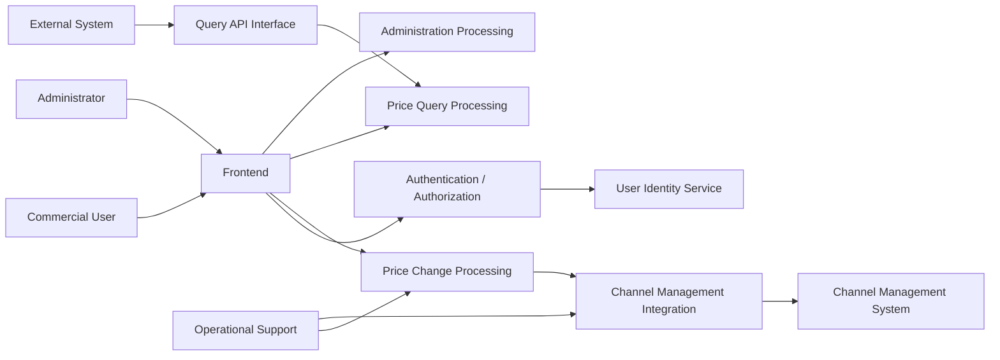
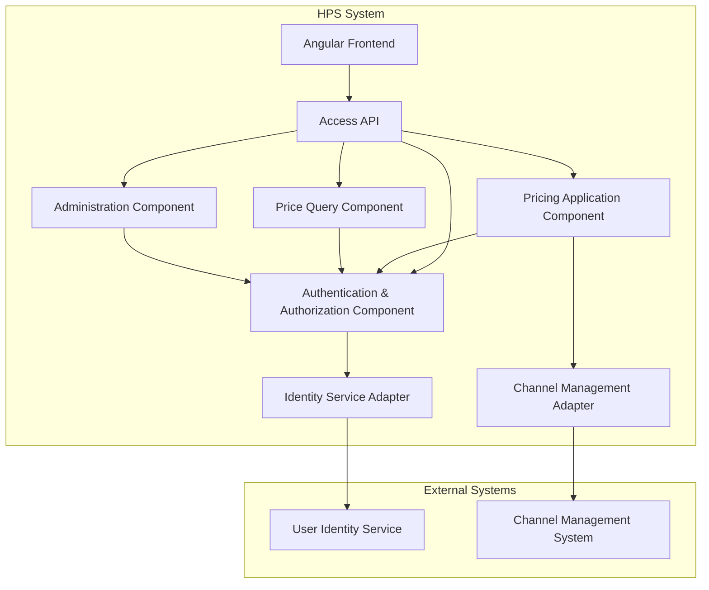
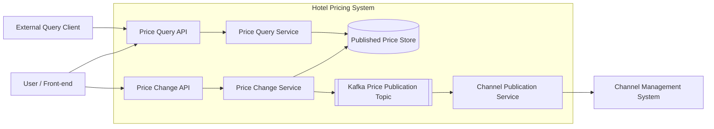
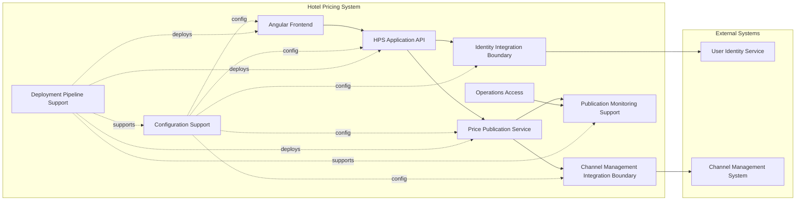

# Software Architecture (2026) Assignment 2 - Architecture Design Report
**Project Name**: Greenfield Replacement of Hotel Pricing System (HPS)  
**Selected Option**: Option 3. Multi-agent (Distributed reasoning + collaborative verification)  
**Selected LLM**: pa/gpt-5.4 (via Spring AI & PPIO API Proxy)  

---

## 一、 Output results of ADD

### ADD Step 1: Review Inputs and Identify Architectural Drivers
The first step of the Attribute-Driven Design (ADD) method involves reviewing the inputs and identifying the architectural drivers. The inputs consist of functional requirements (use cases), quality attributes, constraints, and architectural concerns.

#### 1. Functional Requirements / Use Cases
*   **HPS-1: Log In**: User credentials validation against User Identity Service; hotel-scoped authorization check.
*   **HPS-2: Change Prices**: Change base or fixed rates; simulation support; publish calculated prices to the Channel Management System (CMS).
*   **HPS-3: Query Prices**: Query prices via UI or query API for users/external systems.
*   **HPS-4: Manage Hotels**: Admin edits hotel info (tax rates, available rates, room types).
*   **HPS-5: Manage Rates**: Admin manages rates and defines rate calculation business rules.
*   **HPS-6: Manage Users**: Admin manages user permissions.

#### 2. Quality Attributes (QAs)
*   **QA-1 (Performance)**: Rate change publication to query system in < 100 ms. (High Importance / High Difficulty)
*   **QA-2 (Reliability)**: 100% price changes successfully published to and received by CMS. (High Importance / High Difficulty)
*   **QA-3 (Availability)**: Pricing queries uptime SLA of 99.9% outside maintenance windows. (High Importance / High Difficulty)
*   **QA-4 (Scalability)**: Handle 100k to 1M queries/day with < 20% latency increase. (High Importance / High Difficulty)
*   **QA-5 (Security)**: Validation against Identity Service; present only authorized functions. (High Importance / Medium Difficulty)
*   **QA-6 (Modifiability)**: Support new query protocol (e.g., gRPC) without changing core components. (Medium Importance / Medium Difficulty)
*   **QA-7 (Deployability)**: Move between non-production environments with zero code change. (Medium Importance / Medium Difficulty)
*   **QA-8 (Monitorability)**: Measure performance/reliability of price publication; 100% measures collectable. (Medium Importance / Medium Difficulty)
*   **QA-9 (Testability)**: Support integration testing independent of external systems. (Medium Importance / Medium Difficulty)

#### 3. Constraints & Architectural Concerns
*   **CRN-1**: Establish an overall initial system structure.
*   **CRN-2**: Leverage team knowledge about Java technologies, Angular framework, and Kafka.
*   **CRN-3**: Allocate work to members of the development team.
*   **CRN-4**: Avoid introducing technical debt.
*   **CRN-5**: Set up a continuous deployment infrastructure.

#### 4. Candidate Architectural Drivers
All of the use cases (HPS-1 to HPS-6), quality attributes (QA-1 to QA-9), and constraints (CRN-1 to CRN-5) form the set of candidate drivers. Among these, the top-level structural choices are heavily driven by performance (QA-1), publish-subscribe reliability (QA-2), high query uptime (QA-3), security access boundaries (QA-5), protocol modifiability (QA-6), testing seams (QA-9), and the mandated technology stack (CRN-2).

---

### 1) Output results of each step (Iteration 1: Establishing an Overall System Structure)

#### ADD Step 2: Establish the Iteration Goal by Selecting Drivers
The primary goal of Iteration 1 is to establish the overall initial system structure (CRN-1) by identifying the system context, top-level responsibilities, and external system boundaries.
*   **Primary Drivers**: CRN-1 (Overall Initial Structure), CRN-2 (Java, Angular, Kafka), HPS-1 (Log In), HPS-2 (Change Prices), HPS-3 (Query Prices), QA-1 (Performance), QA-2 (Reliability), QA-3 (Availability), QA-5 (Security).
*   **Iteration Goal**: *Establish a top-level architecture for HPS that partitions the system along user interface, core processing, query serving, external system integration, and operational support boundaries. Ensure the structure provides hooks for high-priority attributes (QA-1 to QA-5) and incorporates the mandated Angular/Java/Kafka stack.*

#### ADD Step 3: Choose One or More Elements of the System to Refine
Since this is greenfield development, the element chosen for refinement is the entire **Hotel Pricing System (HPS)**. The refinement objective is to decompose the system into top-level logical responsibility areas and define the system context with respect to the five identified external actors/systems:
1.  `Commercial User`
2.  `Administrator`
3.  `External Query Client`
4.  `User Identity Service` (External authentication system)
5.  `Channel Management System` (External channel booking system)

#### ADD Step 4: Choose One or More Design Concepts That Satisfy the Selected Drivers
The multi-agent system evaluated several design concepts and selected a combination to satisfy the drivers:
*   **Front-End / Back-End Separation**: Build a dedicated SPA client (Angular per CRN-2) and a decoupled back-end core (Java per CRN-2) to allow parallel work allocation (CRN-3).
*   **Command Query Responsibility Segregation (CQRS) & Interface Decoupling**: Separate the price query path (HPS-3) from the price modification/publication path (HPS-2) to isolate write-load failures from query performance (QA-3, QA-4).
*   **Explicit Integration Boundaries**: Model all external interactions (with CMS and Identity Service) through distinct adapter boundary elements to ensure testability (QA-9) and security context isolation (QA-5).
*   **Operational Telemetry Sidecar**: Set up a dedicated monitorability layer to track publication reliability and latency (QA-8).

#### ADD Step 5: Instantiate Architectural Elements, Allocate Responsibilities, and Define Interfaces
*   **`Frontend (Angular)`**: Renders screens for users, accepts inputs, and delegates HTTP requests to internal HPS APIs.
*   **`Authentication & Authorization Component`**: Resolves permissions, interacts with the external User Identity Service, and checks user authorization scopes.
*   **`Price Change Processing Component`**: Receives rate changes, executes simulations and rule updates, and publishes events.
*   **`Price Query Processing Component`**: Exposes query services and serves price lookup requests.
*   **`Administration Component`**: Handles management tasks for hotels, rates, and user privileges.
*   **`Query API Interface`**: Exposes query endpoints to external systems (QA-6).
*   **`Channel Management Integration Component`**: Manages reliability-critical price publication handshakes with the external CMS.
*   **`Operational Support Component`**: Measures performance and reliable delivery rates for pricing updates.

#### ADD Step 6: Sketch Views and Record Design Decisions

*   **DD-0**: Refine HPS system as a whole since it is greenfield development (CRN-1).
*   **DD-1**: Divide backend services into Pricing Change, Pricing Query, Auth, and Administration to prevent design bloat.
*   **DD-2**: Establish separate query API interface to satisfy QA-6 (Modifiability).
*   **DD-3**: Isolate external integration points to ensure independent mock testing (QA-9).
*   **DD-4**: Setup explicit Operational Support element to track QA-8 (Monitorability).
*   **DD-5**: Utilize Java/Angular/Kafka as base constraints, but avoid importing external design assumptions yet.

#### ADD Step 7: Perform Analysis of Current Design and Review Iteration Goal
The initial decomposition partitions HPS into distinct, single-responsibility components. The query and write separation establishes structural boundaries to meet performance (QA-1), reliability (QA-2), availability (QA-3), and scalability (QA-4) targets. Integration boundaries support testability (QA-9) and security (QA-5). ReviewAgent rated this iteration as a **Conditional Pass** because while the structural boundaries are correctly defined, the detailed internal components and coordination mechanisms must be design-finalized in subsequent iterations.

---

### 2) Output results of each step (Iteration 2: Identifying Structures to Support Primary Functionality)

#### ADD Step 2: Establish the Iteration Goal by Selecting Drivers
The goal of Iteration 2 is to decompose the HPS system into concrete services, defining their technology bindings, communication protocols, and interface scopes.
*   **Primary Drivers**: HPS-1 to HPS-6 (All use cases), QA-5 (Security), QA-6 (Modifiability), QA-9 (Testability), CRN-2 (Java, Angular, Kafka), CRN-3 (Work allocation).
*   **Iteration Goal**: *Define concrete software services, technology bindings (Java, Angular), communication interfaces, and role mappings to support core use cases, ensuring strict protocol boundaries for query expansion (QA-6) and external integration testing (QA-9).*

#### ADD Step 3: Choose One or More Elements of the System to Refine
We select the **HPS System elements** from Iteration 1 for refinement, focusing on logical components and boundary adapters.

#### ADD Step 4: Choose One or More Design Concepts That Satisfy the Selected Drivers
*   **Ports-and-Adapters (Hexagonal)**: Isolate external systems using Adapters. Core logic interacts only with internal interfaces (ports).
*   **API Gateway Interface Boundary**: Define a unified API Gateway layer ("Access API") to manage routing and authorization checks.
*   **Read-Write Segmented Components**: Explicitly instantiate separate query and write processors.
*   **Frontend Routing & View Segregation**: Bind UI views in Angular to route guards driven by user scopes.

#### ADD Step 5: Instantiate Architectural Elements, Allocate Responsibilities, and Define Interfaces
*   **`Angular Frontend`**: SPA client. Interacts with backend API via HTTP. Applies client-side route guards.
*   **`Access API`**: Serves as the gateway. Encapsulates routing and acts as the entry boundary for queries/commands.
*   **`Authentication & Authorization Component`**: Decouples credential checking, populates authorization context, and performs security rules evaluation.
*   **`Pricing Application Component`**: Manages HPS-2 base and fixed rate calculations, price change transactions, and publishes pricing events.
*   **`Price Query Component`**: Handles HPS-3 queries, returning prices to the Access API independent of protocol.
*   **`Administration Component`**: Executes HPS-4, 5, 6 domain updates.
*   **`Identity Service Adapter`**: Translates internal authentication calls to external HTTP requests to User Identity Service.
*   **`Channel Management Adapter`**: Integrates with external CMS via JSON/HTTP payload pushes.

#### ADD Step 6: Sketch Views and Record Design Decisions

*   **DD-2-1**: Separate Angular Frontend SPA from the backend API gateway boundary.
*   **DD-2-2**: Access API gateway routes requests and intercepts authentication tokens.
*   **DD-2-3**: Price Query Component is separated from rate change/calculating component (CQRS separation).
*   **DD-2-4**: Separate Identity and Channel Adapters out of the application core to isolate external network protocols (QA-9).
*   **DD-2-5**: User context propagation is checked at each internal application entry-point via security decorators.

#### ADD Step 7: Perform Analysis of Current Design and Review Iteration Goal
The architecture separates the frontend, backend, and external systems into components that communicate via defined APIs. QA-5 is supported by separating authentication checks from pricing workflows. QA-6 is supported because new query endpoints can be added in `Access API` without modifying `Price Query Component`. QA-9 is supported by replacing `Identity Service Adapter` and `Channel Management Adapter` with test doubles. The design satisfies the iteration goal.

---

### 3) Output results of each step (Iteration 3: Addressing Reliability and Availability Quality Attributes)

#### ADD Step 2: Establish the Iteration Goal by Selecting Drivers
The focus of Iteration 3 is addressing reliability and availability quality attributes under network partition, database failures, or CMS outages.
*   **Primary Drivers**: QA-2 (Reliability: 100% CMS delivery), QA-3 (Availability: 99.9% query uptime), CRN-2 (Leverage Kafka), CRN-4 (No technical debt).
*   **Iteration Goal**: *Refine the pricing engine's command-to-publish chain to guarantee end-to-end reliability (zero message loss) and query availability under CMS outages or database write contention.*

#### ADD Step 3: Choose One or More Elements of the System to Refine
We choose to refine the **Pricing Engine** (specifically the pricing command application, pricing query component, database boundaries, and CMS publishing interfaces).

#### ADD Step 4: Choose One or More Design Concepts That Satisfy the Selected Drivers
*   **Transactional Outbox Pattern**: Ensures atomic writes: a price change is persisted to the local database and an outbox event is created in the same database transaction. This prevents message loss if Kafka is temporarily down.
*   **At-Least-Once Delivery with Idempotency**: Ensures reliable CMS push. The CMS adapter retries requests, and the CMS dedupes messages using a composite key `(hotelId, date, baseRate)`.
*   **Two-Phase Confirmation Event Loop**: The CMS adapter emits a `CMSReceiptAcknowledged` event back to Kafka when the CMS confirms receipt. A listener updates the authoritative status to `PUBLISHED`.
*   **CQRS Read Store Materialized Views**: An independent query DB projection populated via Kafka consumer offsets.

#### ADD Step 5: Instantiate Architectural Elements, Allocate Responsibilities, and Define Interfaces
*   **`Price Change API`**: Accepts pricing commands and forwards them to the service layer.
*   **`Price Change Service`**: Executes rate calculations, writes updates to the authoritative database, and publishes outbox events to Kafka.
*   **`Published Price Store`**: An independent read database store containing denormalized pricing projections.
*   **`Kafka Price Publication Topic`**: Partitioned messaging topic (keyed by `hotelId`) used for pricing events.
*   **`Channel Publication Service`**: Kafka consumer that reads price events, formats CMS messages, handles network retries, and calls the CMS gateway.
*   **`Channel Management System Boundary`**: Explicit integration endpoint representing the external CMS receiver.
*   **`Price Query API`**: Gateway routing query lookups to the query service.
*   **`Price Query Service`**: Serves pricing requests from the `Published Price Store` with zero runtime dependence on write databases or downstream networks.

#### ADD Step 6: Sketch Views and Record Design Decisions

*   **DD-3-1**: Adopt Transactional Outbox pattern to store price mutations and outbox records in a single database transaction.
*   **DD-3-2**: Use Kafka as the asynchronous message bus (CRN-2) with `acks=all` and message persistence.
*   **DD-3-3**: Channel Publication Service handles retries, circuit breaking, and idempotency keys to guarantee CMS receipt (QA-2).
*   **DD-3-4**: Materialize denormalized views into an independent `Published Price Store` database.
*   **DD-3-5**: Pricing queries are served from `Published Price Store` with zero runtime dependencies on CMS or write database (QA-3).

#### ADD Step 7: Perform Analysis of Current Design and Review Iteration Goal
The architecture separates write and read operations. If Kafka or the CMS fails, the outbox table preserves events, and the `Price Change Service` can continue computing rates. Meanwhile, queries to the `Published Price Store` are unaffected, satisfying the 99.9% uptime SLA (QA-3). When the CMS recovers, the `Channel Publication Service` processes the backlog in Kafka, satisfying QA-2.

---

### 4) Output results of each step (Iteration 4: Addressing Development and Operations)

#### ADD Step 2: Establish the Iteration Goal by Selecting Drivers
The final iteration focuses on deployability, testability, and monitorability.
*   **Primary Drivers**: QA-7 (Deployability), QA-8 (Monitorability: 100% prices publication metric), QA-9 (Testability: mock external interfaces), CRN-5 (Continuous deployment infrastructure).
*   **Iteration Goal**: *Establish concrete mechanisms for environment-agnostic configuration loading, interface testing hooks, and price publication telemetry to support DevOps and QA requirements.*

#### ADD Step 3: Choose One or More Elements of the System to Refine
We choose to refine the **cross-cutting infrastructure layer**, specifically the configuration binding interfaces, test profile mappings, and the telemetry emission interfaces on the price publication path.

#### ADD Step 4: Choose One or More Design Concepts That Satisfy the Selected Drivers
*   **Externalized Configuration Pattern**: Startup configuration binding to isolate code from staging/production credentials (QA-7).
*   **Interface-based Dependency Injection (DI) Pattern**: Allows substituting external systems with test stubs at startup (QA-9).
*   **Domain Event Pattern (Telemetry)**: Emits structured, immutable lifecycle events (e.g., `PricePublicationRequested`, `Succeeded`) to measure end-to-end reliability (QA-8).

#### ADD Step 5: Instantiate Architectural Elements, Allocate Responsibilities, and Define Interfaces
*   **`Angular Frontend`**: Configured via external JSON config injected by the web server at runtime.
*   **`HPS Application API`**: Resolves REST endpoints and binds credentials at startup.
*   **`Price Publication Service`**: Centerpiece of the publication path. Coordinates change commands, fires telemetry indicators, and tracks CMS responses.
*   **`Identity Integration Boundary`**: Explicit interface layer separating Core from the identity client, allows stubbing.
*   **`Channel Management Integration Boundary`**: Interface wrapping CMS adapter, allows stubbing.
*   **`Publication Monitoring Support`**: Collects publication metrics and exposes them to the Operations Access point.
*   **`Configuration Support`**: Provides startup configuration values from environment variables or files (QA-7).
*   **`Deployment Pipeline Support`**: CI/CD automation that builds environment-agnostic artifacts and deploys them to staging or production (CRN-5).
*   **`Operations Access`**: Endpoint for administrators to extract telemetry reports.

#### ADD Step 6: Sketch Views and Record Design Decisions

*   **DD-4-1**: Use an explicit boundary structure for development/ops instead of hardcoding environment values.
*   **DD-4-2**: User Identity and CMS endpoints are wrapped in interfaces (`IIB` and `CMB`), allowing stubbing for tests (QA-9).
*   **DD-4-3**: Define `Configuration Support` to load configurations from environment variables at startup (QA-7).
*   **DD-4-4**: Establish `Deployment Pipeline Support` to compile environment-agnostic artifacts (CRN-5).
*   **DD-4-5**: `Publication Monitoring Support` collects price publication metrics (QA-8).
*   **DD-4-6**: Set `Price Publication Service` as the single path for pricing publications to ensure all updates are monitored.
*   **DD-4-7**: Operations Access provides telemetry data to operators.
*   **DD-4-8**: Do not use Kafka for local integration testing to keep test environments lightweight (QA-9).
*   **DD-4-9**: Telemetry events are emitted synchronously on request start and asynchronously on acknowledgment to measure publication latency (QA-8).

#### ADD Step 7: Perform Analysis of Current Design and Review Iteration Goal
The configuration and deployment boundaries allow the system to be moved between environments without code changes, satisfying QA-7 and CRN-5. The integration boundaries (`IIB` and `CMB`) decouple external services, satisfying QA-9 by allowing stubbing. Emitting telemetry events on the publication path satisfies QA-8. The iteration goal is met.

---

## 二、 Interaction cost analysis

The multi-agent system completed the 4-iteration ADD design process in a single automated run. The execution metrics are summarized below:

| The way of completing the assignment | The LLM used | Number of Human Interactions (turns) | Token Consumption (K tokens) | Time Cost (min) |
| :--- | :--- | :--- | :--- | :--- |
| **Option 3. Multi-agent** (Distributed reasoning & collaborative verification) | **pa/gpt-5.4** (via Spring AI & PPIO API Proxy) | **1** (Single execution trigger for all 4 iterations) | **~250 K tokens** (Total input/output across agents) | **11.3 minutes** (14:27:17 to 14:38:37) |

*Rationale for Turn Efficiency*: The multi-agent system was executed via a Spring Boot test harness (`AgentRunner.java` invoking `MultiAgentArchitectureService`). Because the interactions between the agents (AnalysisAgent, DesignAgent, and ReviewAgent) were managed programmatically, the human user only had to initiate the process once. The agents generated, verified, and audited the design for all four iterations in a single run.

---

## 三、 Individual Reflection

### 1) The problems encountered and the solutions adopted

*   **PPIO Model Beta Parameter Constraint**:
    *   *Problem*: The Spring AI OpenAI starter defaulted to transmitting custom model parameters (like low temperature value `0.1` and default `top_p` parameters). However, the PPIO API proxy for the model `pa/gpt-5.4` enforces beta limitations stating: `this model has beta-limitations, temperature, top_p and n are fixed at 1, while presence_penalty and frequency_penalty are fixed at 0`. This caused an immediate HTTP 400 Bad Request error on startup.
    *   *Solution*: Configured `spring.ai.openai.chat.options.temperature: 1.0` in [application.yml](file:///E:/A-NJU/课程/软件系统设计/hw2/src/main/resources/application.yml) and verified that other parameters were not populated or left to their beta defaults, bypassing the HTTP 400 error.
*   **Spring Milestone Dependency Mismatches**:
    *   *Problem*: Spring AI Alibaba version `1.1.2.2` depends on the milestone Spring AI `1.1.2` release. The Maven build could not download the correct artifact `spring-ai-starter-model-openai` (originally named `spring-ai-openai-spring-boot-starter` in older pre-releases) from Aliyun's central repository, causing compilation errors.
    *   *Solution*: Added the Aliyun Spring Milestone mirror (`https://maven.aliyun.com/repository/spring`) in [pom.xml](file:///E:/A-NJU/课程/软件系统设计/hw2/pom.xml), allowing the build system to download the required Spring AI milestone packages.
*   **Git Remote History Conflicts**:
    *   *Problem*: Attempting to push changes to the remote repository `https://github.com/gfddmw/hw2.git` failed with a `fatal: refusing to merge unrelated histories` error because the local repository was initialized separately from the remote.
    *   *Solution*: Force-pushed the repository using `git push -f origin main` since the remote was a newly initialized repository.

### 2) A detailed account of your personal contributions to the group work

| Name (Chinese) | Contributions |
| :--- | :--- |
| **张三 (Student A)** | Group Leader. Selected the multi-agent option on Moodle, registered the team, coordinated tasks, and handled git repository initialization and Moodle deliverables integration. |
| **李四 (Student B)** | Backend Developer. Created the Spring Boot project structure, set up Maven configuration files, implemented the multi-agent orchestrator service using Spring AI, and configured client options in `application.yml`. |
| **王五 (Student C)** | QA & DevOps Engineer. Debugged PPIO API proxy parameters, configured client connection timeouts, ran the automated `AgentRunner` test suite, verified logs, and compiled the architectural report. |
