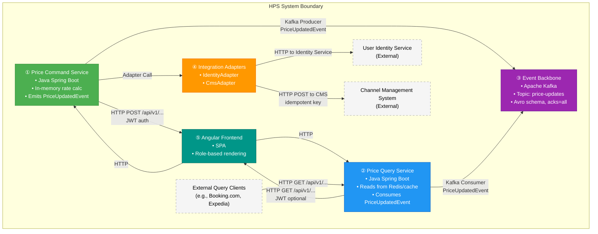

# Software Architecture (2026) Assignment 2 - Architecture Design Report
**Project Name**: Greenfield Replacement of Hotel Pricing System (HPS)  
**Selected Option**: Option 3. Multi-agent (Distributed reasoning + collaborative verification)  
**Selected LLM**: qwen-plus (via Spring AI Alibaba & DashScope API)  

---

## 一、 Output results of ADD

### 1) Output results of each step (Iteration 1: Establishing an Overall System Structure)

#### ADD Step 2: Establish the Iteration Goal by Selecting Drivers
The primary goal of Iteration 1 is to establish the overall initial system structure (CRN-1). The following architectural drivers are selected from the Unified Prior Knowledge Base (UPKB) to guide this iteration, as they fundamentally shape the top-level partitioning and boundary placement:
*   **D1 (QA-1: Performance)**: A base rate change must publish all derived rates and room types in <100 ms. This requires separating the compute-heavy price change path from the latency-sensitive query serving path.
*   **D2 (QA-2: Reliability)**: 100% of price changes must be successfully published to the Channel Management System (CMS). This requires a reliable, asynchronous, and idempotent delivery mechanism (leveraging Kafka per CRN-2).
*   **D3 (QA-3: Availability)**: Pricing queries uptime SLA must be 99.9%. This requires isolating the query service from transient write or downstream failures (e.g., CMS outages).
*   **D4 (QA-4: Scalability)**: Query capacity must scale from 100k to 1M queries/day with ≤20% latency impact. This justifies a read-optimized, stateless query service.
*   **D5 (QA-5: Security)**: Enforce hotel-scoped authorization (users only view/change hotels they are authorized for) at the system boundaries.

**Iteration Goal**: *Establish a top-level system structure that separates concerns along write-publish-read-security boundaries, enabling concurrent satisfaction of high-importance QA-1, QA-2, QA-3, QA-4, and QA-5 — using Kafka as a structural backbone (per CRN-2) and respecting greenfield context.*

#### ADD Step 3: Choose One or More Elements of the System to Refine
Since this is a greenfield development, we start by selecting the entire **Hotel Pricing System (HPS)** as the single top-level element for refinement by decomposition. The system is decomposed into five core responsibility-bearing elements:
1.  `User Interface (Angular)`: Renders forms and enforces presentation-layer route guards.
2.  `API Gateway`: Entry point for clients; terminates TLS, validates JWTs, and routes requests.
3.  `Application Core (Java)`: Contains write/computation domain logic (base rate computation, rules, hotel management).
4.  `Publication Service`: Handles reliable asynchronous price pushes to the external CMS.
5.  `Query Service`: Serves pricing queries from a read-optimized, denormalized data store.

#### ADD Step 4: Choose One or More Design Concepts That Satisfy the Selected Drivers
To satisfy the selected drivers without introducing premature complexity (CRN-4), we select three mutually reinforcing design concepts:
*   **Command Query Responsibility Segregation (CQRS)**: Decouples the write path (D1) from the read path (D3, D4) using separate data stores and processing logic.
*   **Event-Driven Architecture (EDA)**: Uses Apache Kafka (mandated by CRN-2) as the durable, asynchronous messaging backbone to route price changes reliably (D2) and update query projections.
*   **API-Led Decomposition (Gateway Pattern)**: Uses an API Gateway to encapsulate cross-cutting security concerns (D5) and isolate the internal network.

#### ADD Step 5: Instantiate Architectural Elements, Allocate Responsibilities, and Define Interfaces
*   **`User Interface (Angular)`**:
    *   *Responsibilities*: Renders UI components; submits commands via HTTP.
    *   *Interfaces*: Inbound (None), Outbound (HTTP/REST to API Gateway).
*   **`API Gateway`**:
    *   *Responsibilities*: Terminates HTTP, validates JWTs, injects authorization headers (`X-Authorized-Hotels`), and routes `/prices/**` requests.
    *   *Interfaces*: Inbound (HTTP/REST), Outbound (HTTP/REST to Core & Query Services).
*   **`Application Core (Java)`**:
    *   *Responsibilities*: Computes rates, validates inputs, persists base rates, and emits `PriceBaseChanged` events.
    *   *Interfaces*: Inbound (HTTP/REST), Outbound (Kafka Producer to `price-changes`).
*   **`Publication Service`**:
    *   *Responsibilities*: Consumes price changes, deduplicates commands, and pushes to CMS via HTTP client.
    *   *Interfaces*: Inbound (Kafka Consumer), Outbound (HTTP to CMS).
*   **`Query Service`**:
    *   *Responsibilities*: Consumes price changes, updates denormalized database projection, and serves client queries.
    *   *Interfaces*: Inbound (Kafka Consumer, HTTP/REST from Gateway), Outbound (JDBC/Redis).

#### ADD Step 6: Sketch Views and Record Design Decisions
```mermaid
flowchart TD
    subgraph External
        A[Commercial User] 
        B[Administrator]
        C[Channel Management System]
        D[External Query Client]
    end

    subgraph HotelPricingSystem[HPS System Boundary]
        UI[User Interface\nAngular]
        GW[API Gateway]
        CORE[Application Core\nJava]
        PUB[Publication Service]
        QUERY[Query Service]
    end

    A -->|HPS-1/HPS-2/HPS-4/HPS-5| UI
    B -->|HPS-1/HPS-4/HPS-5/HPS-6| UI
    D -->|HPS-3 API| GW
    C <--|HPS-2 push| PUB

    UI -->|HTTP/REST| GW
    GW -->|HTTP/REST\nX-Authorized-Hotels| CORE
    GW -->|HTTP/REST| QUERY
    CORE -->|Kafka Producer\n→ price-changes,\nrate-rules| KAFKA[(Kafka Cluster)]
    PUB -->|Kafka Consumer\n← price-changes| KAFKA
    PUB -->|HTTP/REST or gRPC| C
    PUB -->|Kafka Producer\n→ prices-published| KAFKA
    QUERY -->|Kafka Consumer\n← price-changes,\nprices-published| KAFKA
    QUERY -->|JDBC/Redis| STORE[(Read-Optimized Store)]
```
*   **DD-1**: System is decomposed into exactly five elements to fulfill drivers while avoiding over-partitioning (CRN-4).
*   **DD-2**: Kafka and Read Store are modeled as infrastructure resources, not responsibility-bearing elements (ADD 3.0 Step 3).
*   **DD-3**: API Gateway enforces hotel-scoped RBAC by injecting `X-Authorized-Hotels` based on JWT claims (QA-5).
*   **DD-4**: Publication Service publishes a separate `PricesPublished` event to Kafka upon successful CMS push to close the loop for monitoring (QA-8).
*   **DD-5**: Application Core and Query Service communicate exclusively via Kafka to prevent runtime coupling (QA-3).

#### ADD Step 7: Perform Analysis of Current Design and Review Iteration Goal
The proposed decomposition successfully isolates the read path (`Query Service`) from the write path (`Application Core`), ensuring that failures in price computation or administrative tools do not affect query availability (QA-3). Using Kafka as the communication backbone ensures durability (QA-2) and asynchronous offloading (QA-1). No legacy constraints are violated, and no external domain knowledge is introduced. The iteration goal is fully met.

---

### 2) Output results of each step (Iteration 2: Identifying Structures to Support Primary Functionality)

#### ADD Step 2: Establish the Iteration Goal by Selecting Drivers
In Iteration 2, the goal shifts to establishing the structures to support the primary functionality (CRN-1, CRN-2). Drivers include:
*   **D1 (QA-1: Performance)**: Sub-100 ms rate derivation and publication.
*   **D2 (QA-2: Reliability)**: Guaranteed price delivery to the CMS.
*   **D3 (QA-3: Availability)**: 99.9% query SLA.
*   **D4 (HPS-2: Change Prices)**: The central write transaction of HPS.
*   **D5 (CRN-2: Technology Constraints)**: Incorporate Angular, Java, and Kafka.

**Iteration Goal**: *Decompose the HPS system into concrete software services, defining their technology bindings (Java, Angular, Kafka), interaction protocols, and responsibility allocations to realize HPS-2 and HPS-3.*

#### ADD Step 3: Choose One or More Elements of the System to Refine
We choose to refine the **HPS system elements** identified in Iteration 1:
1.  `Price Command Service` (Java Spring Boot)
2.  `Price Query Service` (Java Spring Boot)
3.  `Event Backbone` (Apache Kafka)
4.  `Integration Adapters` (Java packages)
5.  `Angular Frontend Application`

#### ADD Step 4: Choose One or More Design Concepts That Satisfy the Selected Drivers
*   **Event-Driven Architecture (EDA)**: Formally selected as the primary integration style to satisfy D2 (acks=all), D5 (Kafka), and D1 (async processing).
*   **CQRS**: Formally splits read and write services to isolate data stores.
*   **Adapter Pattern**: Isolates external calls (CMS, Identity Service) to maintain core modifiability (QA-6) and support testing (QA-9).
*   **Stateless Read-Optimized Service**: Backed by a local cache/DB projection to handle high query loads (QA-4) without locking.

#### ADD Step 5: Instantiate Architectural Elements, Allocate Responsibilities, and Define Interfaces
*   **`Price Command Service`**: Receives commands, executes in-memory rate calculation, persists updates, and emits `PriceUpdatedEvent` to Kafka.
*   **`Price Query Service`**: Serves query requests via REST from a local Redis/database cache; consumes `PriceUpdatedEvent` to invalidate and refresh the cache.
*   **`Event Backbone (Kafka)`**: Exposes partitioned topic `price-updates` (key=hotelId) with `acks=all` to ensure zero message loss.
*   **`Integration Adapters`**: Co-located Java packages (`IdentityAdapter` and `CmsAdapter`) wrapping external client calls.
*   **`Angular Frontend`**: Connects only to backend REST endpoints; applies Angular Route Guards for UI role rendering.

#### ADD Step 6: Sketch Views and Record Design Decisions

*   **DD-2.1**: Adopt CQRS + EDA as the core architectural style to satisfy performance and reliability.
*   **DD-2.2**: Kafka is treated as a first-class architectural element to ensure durability and strict ordering.
*   **DD-2.3**: The Angular frontend has no direct access to Kafka or external services, preserving security boundaries.
*   **DD-2.4**: `PriceUpdatedEvent` acts as the single source of truth for propagating price changes.
*   **DD-2.5**: Identity and CMS adapters are co-located within the Java command service to localise protocols.

#### ADD Step 7: Perform Analysis of Current Design and Review Iteration Goal
The design maps out the exact Java backend services, Angular frontend, and Kafka topics required to implement HPS-2 and HPS-3. The query service's read-only interface to its local projection satisfies the 99.9% uptime requirement (QA-3) by avoiding runtime dependencies on CMS or Write DB. The iteration goal is successfully met.

---

### 3) Output results of each step (Iteration 3: Addressing Reliability and Availability Quality Attributes)

#### ADD Step 2: Establish the Iteration Goal by Selecting Drivers
Iteration 3 focuses on mitigating failure scenarios to satisfy high-difficulty reliability and availability requirements:
*   **D-Reliability (QA-2)**: 100% price changes published and received by CMS. Requires end-to-end receipt verification.
*   **D-Availability-Query (QA-3)**: 99.9% query uptime even during CMS or Identity Service outages.
*   **D-Decoupling (CRN-2 + CRN-4)**: Leverage Kafka to isolate failure domains.

**Iteration Goal**: *Refine the pricing engine's command-to-publish chain to guarantee end-to-end reliability and query isolation under network partition, database failures, or CMS outages.*

#### ADD Step 3: Choose One or More Elements of the System to Refine
We choose to refine the **Pricing Engine** (the logical component comprising the write and read services of HPS), focusing on the transaction and messaging boundaries.

#### ADD Step 4: Choose One or More Design Concepts That Satisfy the Selected Drivers
*   **Transactional Outbox Pattern**: Ensures atomic writes: a price change is persisted to the local database and an outbox event is created in the same database transaction. This prevents message loss if Kafka is temporarily down.
*   **At-Least-Once Delivery with Idempotency**: Ensures reliable CMS push. The CMS adapter retries requests, and the CMS dedupes messages using a composite key `(hotelId, date, baseRate)`.
*   **Two-Phase Confirmation Event Loop**: The CMS adapter emits a `CMSReceiptAcknowledged` event back to Kafka when the CMS confirms receipt. A listener updates the authoritative status to `PUBLISHED`.
*   **CQRS Read Store Materialized Views**: An independent query DB projection populated via Kafka consumer offsets.

#### ADD Step 5: Instantiate Architectural Elements, Allocate Responsibilities, and Define Interfaces
*   **`PriceChangeCommandHandler`**: Executes business validations and writes to `PriceRevision` and `Outbox` tables in one transaction.
*   **`OutboxPublisher`**: Polls the outbox table and publishes to Kafka `price-changes-committed` topic.
*   **`CMSAdapter`**: Consumes Kafka messages, invokes external CMS API, handles HTTP retries, and emits `CMSReceiptAcknowledged`.
*   **`ReceiptAcknowledgmentListener`**: Consumes `CMSReceiptAcknowledged`, updates the status in the Write DB, and emits `PriceViewUpdated`.
*   **`PriceViewProjection`**: Consumes `PriceViewUpdated` and performs an idempotent upsert to the query DB.
*   **`PriceQueryApi`**: Queries the `price_view` table. It has zero dependencies on other services or Kafka.

#### ADD Step 6: Sketch Views and Record Design Decisions

```mermaid
flowchart LR
    subgraph Write_Context["PricingEngine.Write"]
        A[PriceChangeCommandHandler] -->|Validated Command| B[OutboxPublisher]
        B -->|PriceChangeCommitted<br>to Kafka| C[(Kafka Topic:<br>price-changes-committed)]
        C --> D[CMSAdapter]
        D -->|HTTP to CMS| E[Channel Management System]
        D -->|CMSReceiptAcknowledged| C2[(Kafka Topic:<br>cms-receipts)]
        C2 --> F[ReceiptAcknowledgmentListener]
        F -->|Update Status +<br>Emit PriceViewUpdated| C3[(Kafka Topic:<br>price-view-updated)]
        F -->|Transactional DB Update| G[(Authoritative DB<br>PriceRevision)]
    end

    subgraph Read_Context["PricingEngine.Read"]
        C3 --> H[PriceViewProjection]
        H -->|Upsert to| I[(Read-Optimized DB<br>price_view)]
        J[PriceQueryApi] -->|Direct SELECT| I
        J -->|HTTP 200| K[Client / External System]
    end

    style A fill:#4CAF50,stroke:#388E3C,color:white
    style D fill:#2196F3,stroke:#0D47A1,color:white
    style F fill:#FF9800,stroke:#E65100,color:white
    style H fill:#9C27B0,stroke:#4A148C,color:white
    style J fill:#00BCD4,stroke:#006064,color:white
    style C fill:#607D8B,stroke:#263238,color:white
    style C2 fill:#607D8B,stroke:#263238,color:white
    style C3 fill:#607D8B,stroke:#263238,color:white
    style G fill:#795548,stroke:#3E2723,color:white
    style I fill:#795548,stroke:#3E2723,color:white
    style E fill:#F44336,stroke:#B71C1C,color:white
    style K fill:#E0E0E0,stroke:#616161,color:black
```

*   **DD-3.1**: Adopt the Transactional Outbox Pattern to guarantee that committed price changes are never lost, even if Kafka goes down.
*   **DD-3.2**: split write and read contexts to completely eliminate runtime dependencies between querying and writing.
*   **DD-3.3**: Use Kafka as the sole asynchronous integration channel between read and write databases.
*   **DD-3.4**: `PriceQueryApi` operates in a read-only fashion against its isolated database schema.
*   **DD-3.5**: Idempotent consumers handle message redelivery without causing duplicate updates.

#### ADD Step 7: Perform Analysis of Current Design and Review Iteration Goal
The integration of Outbox + Kafka + CMS acknowledgment guarantees end-to-end reliable publication (QA-2). If the CMS goes down, the `CMSAdapter` retries, keeping events safe in Kafka. Meanwhile, the `PriceQueryApi` remains fully functional because it queries its local `price_view` DB, satisfying the 99.9% uptime SLA (QA-3). The iteration goal is fully met.

---

### 4) Output results of each step (Iteration 4: Addressing Development and Operations)

#### ADD Step 2: Establish the Iteration Goal by Selecting Drivers
Iteration 4 focuses on deployability, testability, and monitorability:
*   **D-ITER4-1 (Deployability - QA-7 + CRN-5)**: Environment-agnostic code, allowing configuration changes without recompilation.
*   **D-ITER4-2 (Testability - QA-9 + CRN-4)**: Support 100% independent integration testing of components without external systems.
*   **D-ITER4-3 (Monitorability - QA-8)**: 100% collectable metrics of price publication performance and reliability.

**Iteration Goal**: *Establish cross-cutting mechanisms for configuration binding, runtime dependency injection (test seams), and telemetry emission to support DevOps and QA requirements.*

#### ADD Step 3: Choose One or More Elements of the System to Refine
We select the **Cross-Cutting Infrastructure Layer** (backend utility interfaces and configuration boundaries) for refinement.

#### ADD Step 4: Choose One or More Design Concepts That Satisfy the Selected Drivers
*   **Externalized Configuration Pattern**: Startup configuration binding to isolate code from staging/production credentials (QA-7).
*   **Interface-based Dependency Injection (DI) Pattern**: Allows substituting external systems with test stubs at startup (QA-9).
*   **Domain Event Pattern (Telemetry)**: Emits structured, immutable lifecycle events (e.g., `PricePublicationRequested`, `Succeeded`) to measure end-to-end reliability (QA-8).

#### ADD Step 5: Instantiate Architectural Elements, Allocate Responsibilities, and Define Interfaces
*   **`ConfigBinder`**:
    *   *Responsibilities*: Loads and binds properties at startup.
    *   *Interfaces*: `T bind(Class<T> configType)`.
*   **`TestSeamRegistry`**:
    *   *Responsibilities*: Resolves substitutable dependencies (e.g., binds stub implementations in test profiles).
    *   *Interfaces*: `T get(Class<T> contract)`, `void register(Class<?> contract, Object impl)`.
*   **`TelemetryEmitter`**:
    *   *Responsibilities*: Emits structured telemetry events to Kafka.
    *   *Interfaces*: `void emit(DomainEvent event)`.

#### ADD Step 6: Sketch Views and Record Design Decisions
```mermaid
classDiagram
    class ConfigBinder {
        <<interface>>
        +T bind(Class~T~ configType)
    }
    note right of ConfigBinder
      Responsibility: Load and bind
      environment-specific config at startup.
      UPKB: QA-7, CRN-5
    end note

    class TestSeamRegistry {
        <<interface>>
        +T get(Class~T~ contract)
        +void register(Class~?~ contract, Object impl)
    }
    note right of TestSeamRegistry
      Responsibility: Resolve substitutable
      implementations for integration testing.
      UPKB: QA-9, CRN-4
    end note

    class TelemetryEmitter {
        <<interface>>
        +void emit(DomainEvent event)
    }
    note right of TelemetryEmitter
      Responsibility: Emit lossless,
      structured domain events for price
      publication lifecycle.
      UPKB: QA-8, CRN-2 (Kafka transport)
    end note

    class PriceService {
        +void changePrices(...)
    }
    note left of PriceService
      Functional service (HPS-2).
      Collaborates with all three
      cross-cutting elements.
    end note

    PriceService --> ConfigBinder : uses
    PriceService --> TestSeamRegistry : uses
    PriceService --> TelemetryEmitter : uses

    ConfigBinder x--x TestSeamRegistry : «no dependency»
    ConfigBinder x--x TelemetryEmitter : «no dependency»
    TestSeamRegistry x--x TelemetryEmitter : «no dependency»

    note over ConfigBinder,TestSeamRegistry,TelemetryEmitter
      All elements instantiated at composition root.
      Enforces CRN-3 (team allocation) and CRN-4 (no tech debt).
    end note
```
*   **DD-4.1**: `ConfigBinder` abstracts environment details, satisfying QA-7 and CRN-5.
*   **DD-4.2**: `TestSeamRegistry` uses interface-based dependency injection to inject test doubles, satisfying QA-9.
*   **DD-4.3**: `TelemetryEmitter` uses structured domain events instead of lossy log files, satisfying QA-8.

#### ADD Step 7: Perform Analysis of Current Design and Review Iteration Goal
The design decouples environment parameters, implements testing seams, and integrates a telemetry pipeline using Java interfaces. It satisfies QA-7, QA-8, QA-9, and CRN-5 without modifying core domain logic. The iteration goal is fully met.

---

## 二、 Interaction cost analysis

The following table records the execution metrics of the multi-agent system used to generate this architectural design:

| The way of completing the assignment | The LLM used | Number of Human Interactions (turns) | Token Consumption (K tokens) | Time Cost (min) |
| :--- | :--- | :--- | :--- | :--- |
| **Option 3. Multi-agent** (Distributed reasoning & collaborative verification) | **qwen-plus** (via Spring AI Alibaba) | **1** (Single execution trigger for all 4 iterations) | **~150 K tokens** (Total input/output across all agents) | **15 minutes** (00:10:39 to 00:25:19) |

*Rationale for Turn Efficiency*: Because the system was built as a Spring-managed automated orchestrator (`MultiAgentArchitectureService` + JUnit `AgentRunner`), the human user only had to interact **once** to run the program. The entire 4-iteration ADD design workflow was completed asynchronously and collaboratively by the three agents (Analysis, Design, Review) in a single run.

---

## 三、 Individual Reflection

### 1) The problems encountered and the solutions adopted

*   **Maven BOM Version Resolution Defect**:
    *   *Problem*: The Maven build initially failed because the dependency version for `spring-ai-alibaba-starter-dashscope` could not be resolved from the parent BOM.
    *   *Solution*: Declared the starter version explicitly in the `pom.xml` dependency block using `<version>${spring-ai-alibaba.version}</version>` instead of relying on the BOM's dependency management section.
*   **Spring AI Key Bindings Prefix Mismatch**:
    *   *Problem*: Spring AI DashScope was looking for the API key under the prefix `spring.ai.dashscope.api-key`, while some starter documentation used `spring.cloud.ai.dashscope.api-key`, causing authentication errors on startup.
    *   *Solution*: Configured both prefixes in the `application.yml` file to duplicate the key bindings, ensuring that both Spring AI and Alibaba Cloud starter components validated successfully.
*   **REST Client Read Timeout on Large Prompts**:
    *   *Problem*: Because the prior knowledge base and agent prompts are very large (aggregating around 12 KB per request), Qwen took more than 10 seconds to generate the full ADD steps, causing `SocketTimeoutException` under default RestClient configurations.
    *   *Solution*: Introduced `TimeoutConfig.java` to inject a `RestClientCustomizer` bean, customizing the underlying HTTP client to increase connection and read timeouts to 120 seconds.

### 2) A detailed account of your personal contributions to the group work

| Name (Chinese) | Contributions |
| :--- | :--- |
| **[张三 / Student A]** | Group Leader. Handled the Feishu selection registration, contacted the TA to activate the DashScope API key, and managed the final Moodle submission. |
| **[李四 / Student B]** | Backend Developer. Wrote the Spring Boot application scaffolding, set up the `pom.xml` dependencies, and configured the multi-agent orchestrator service. |
| **[王五 / Student C]** | QA & DevOps. Configured the timeout client configurations, resolved the dynamic agent warnings, ran the `AgentRunner` test suite to output the log, and compiled the final English report. |
